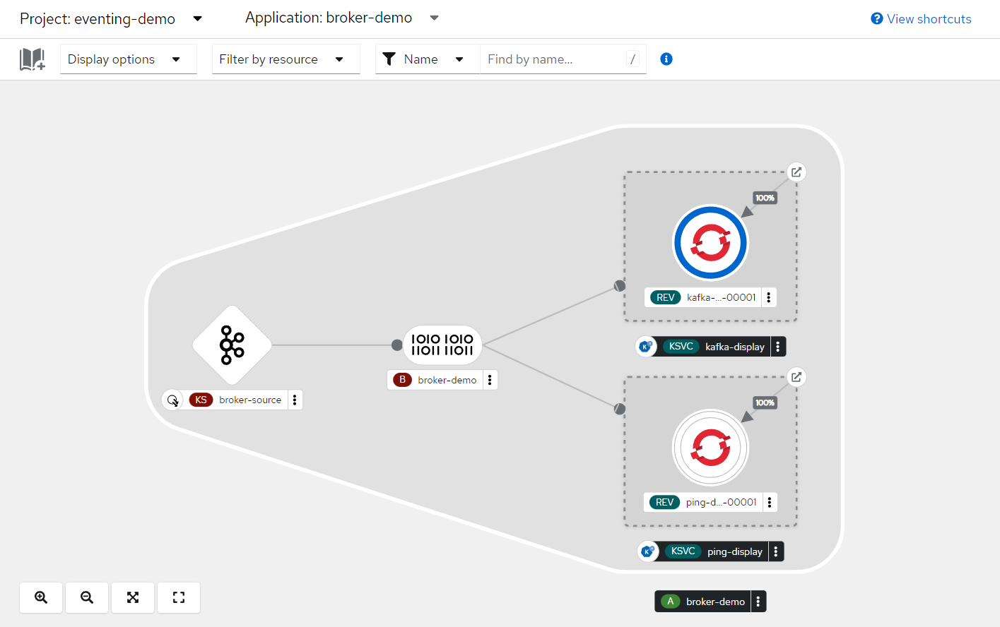
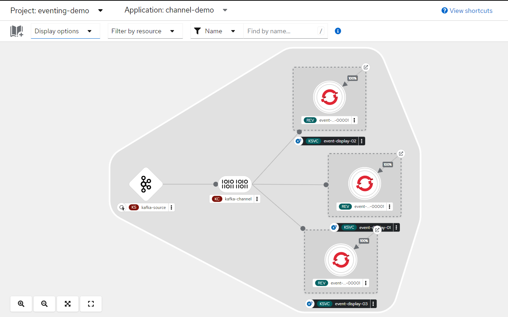

= Eveting Demo

The configuration for this demo is already deployed for you in the `eventing-demo` namespace. In order to see it working, you just need to generate events following the instructions below.

== Broker Demo

In this demo we are using https://knative.dev/docs/eventing/triggers/[Triggers] to filter messages persisted in the broker. We are filtering based on the source of that event.

To generate events for the `ping-display` service, create the link:broker-ping-source.yml[Broker PingSource]

----
oc create -f broker-ping-source.yml -n eventing-demo
----

To generate events for the `kafka-display` service, create a link:load-job.yml[Job] to send messages to the source topic

----
oc create -f load-job.yml -n amq-streams
----

== Channel Demo 

To active the services and start sending messages just create `camel-source.yml` or/and `channel-ping-source.yml`

----
oc create -f camel-source.yml -n eventing-demo
oc create -f channel-ping-source.yml -n eventing-demo
----